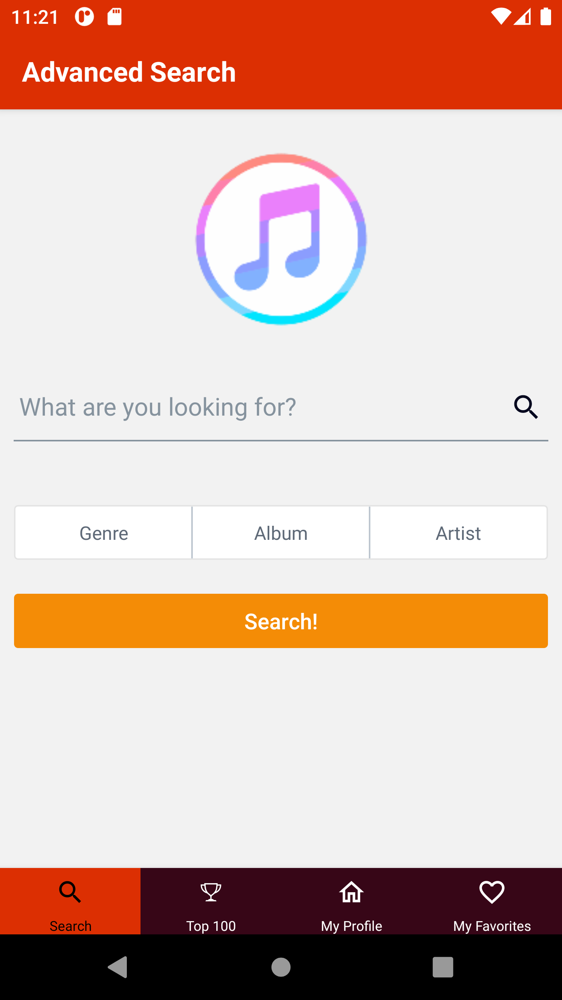
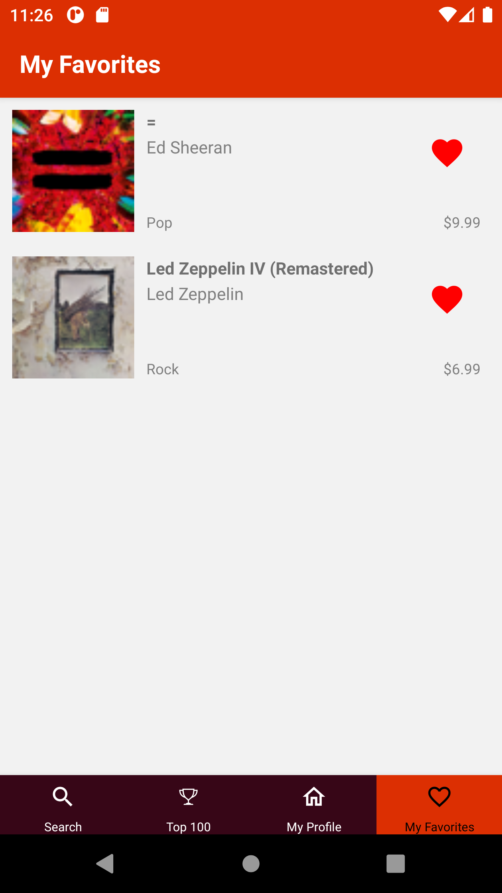
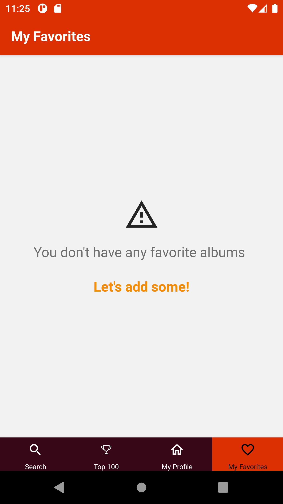
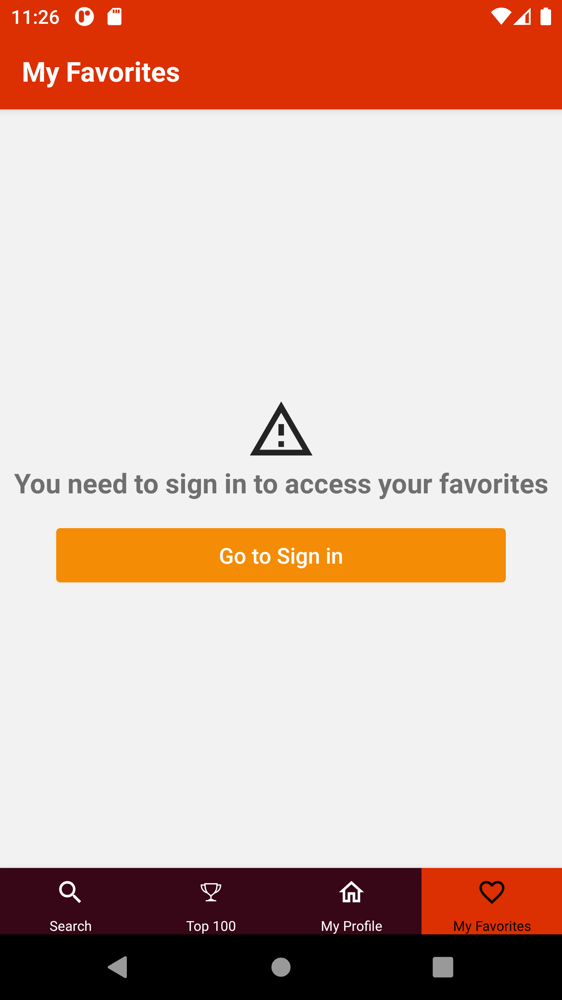

# vetTunes

> Due to the lack of an already functioning macOS machine and time constraints, the simulation build for iOS is missing.

## Account

Registration is simple and intuitive. Following the onscreen hints, you'll be logged in no time!

 

Once you've registered, personalizing your account information takes is done in a few simple taps. Avatar, name, email and password changes are all easily accessible on your account's main screen.

 

## Top 100

Accessing a list of the best albums according to itunes is the one of the simplest things.

 

Where every item on the list is accessible for a more detailed view.

> Notice that the option to add/remove any album from favorites is only available when logged in.

 

You can even tap on your favorite cover arts to access an enlarged view.

 

## Search

You can easily look up any album you want with a few taps.

 

And you can even refine your search by Album, Artist or Category.

 

Acquiring a list of the albums you were looking for.

 

And access them for a detailed view

 

While being informed if it's not on the database

 

## Favorites

Access your list of favorites

 

And see their details

 

Be reminded if you don't have any so far

 

Or even if you've forgotten to sign in

