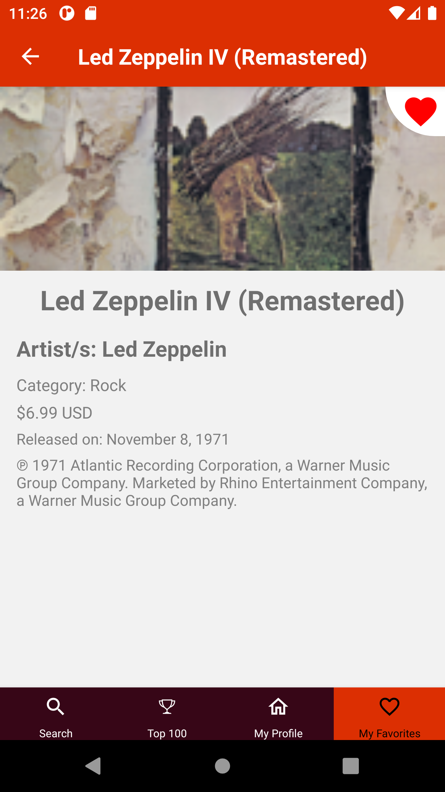

# vetTunes

Mobile app on React Native to access iTunes' 100 top albums, a personal account hosted on firebase to keep track of your favorites and a filtered search feature for ease of access.

- [Challenge](CHALLENGE.md)
- [Features](FEATURES.md)
- [Documentation](DOCUMENTATION.md)

## Preview

You can find a demo ready to install on your Android phone or simulated enviroment of choice in here:

  
 Android Bundle Demo v0.8

  > Demo is currently a debug bundle

<a href="https://drive.google.com/file/d/1ptLP624tPqkkzrY6sK-a2Mn87thcVqL9/view?usp=sharing">Direct download link</a>
or find it on this [repo](androidDemo.apk)

 

>    

 

## Challenge overview

>Work in progress. Access the full challenge in [here](CHALLENGE.md).

 

## Things to improve

- Refactor the firebase connection. Due to connectivity issues common in react native apps outside of Expo builds, replacing the firebase library for react-native-firebase could prove a major improvement for handling favorites, where the connection usually suffer and hangs.
  
- Modularization and more modularization! Implement a third context-reducer to contain things such as the favorites handlers, which I didn't quite expect to reuse so much. Either that or set up a redux.
  
- Work on the albums' visuals. I was hard pressed for time due to all the features I wanted to include, so I barely had any time to give them the love that they diserve.